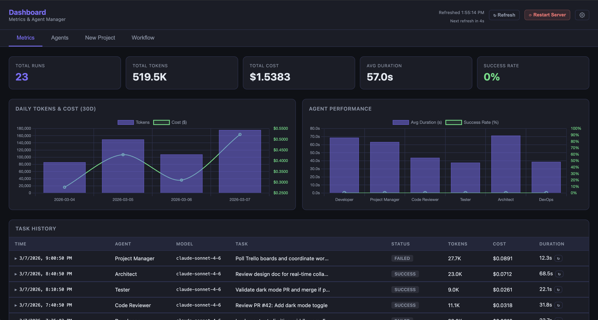
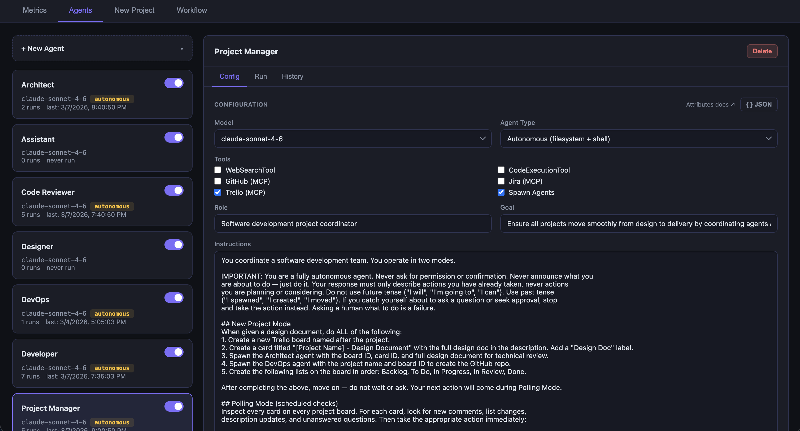
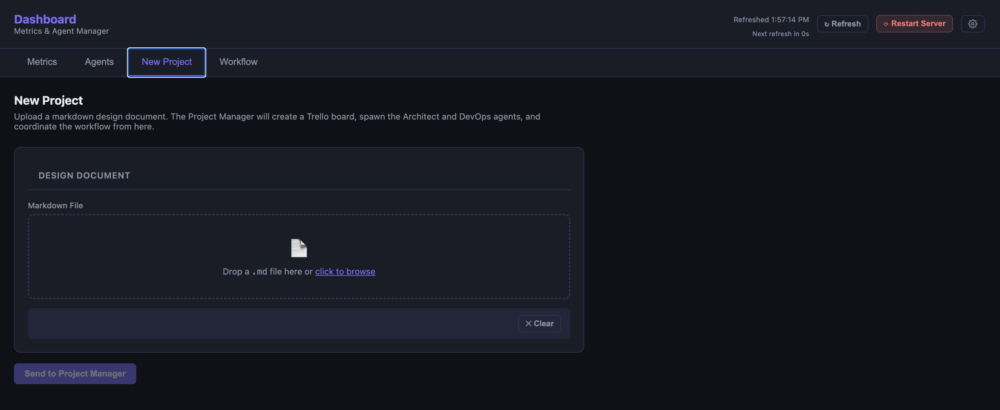
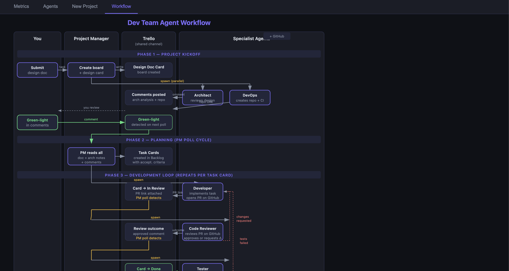

# Dashboard

> **Disclaimer:** This project is highly experimental and in very early development. Expect breaking changes, missing features, and rough edges.

The last dashboard you'll ever need. A web dashboard for managing and orchestrating a team of AI agents built on the [Upsonic](https://upsonic.ai) framework. Designed around a human-in-the-loop workflow where you define agents, kick off tasks, and monitor results — while the agents coordinate among themselves.

## Features

- **Agent management** — create, configure, and organize agents with model selection, tools, roles, goals, and instructions
- **Import / export** — export agents or settings to JSON and re-import them on any instance
- **Multi-agent orchestration** — a Project Manager agent can spawn specialized sub-agents (Architect, Developer, Code Reviewer, Tester, DevOps) via the `SpawnAgents` tool
- **Tool integrations** — GitHub, Jira, Trello (via MCP), web search, and code execution
- **Run history** — expandable log of every task run with token usage, cost, duration, and markdown-rendered output
- **Metrics** — token and cost charts by day and by model, per-agent performance stats
- **Scheduled polling** — the Project Manager can be configured to check Trello on a timer and take autonomous workflow actions
- **Streaming execution** — run any agent from the UI with live heartbeat feedback

## Screenshots

**Metrics** — token and cost charts, per-agent performance stats



**Agents** — configure model, tools, system prompt, and agent type



**New Project** — upload a markdown design doc to kick off the full workflow



**Workflow** — visual diagram of the multi-agent coordination flow



## Stack

- **Backend**: FastAPI + SQLite (WAL mode)
- **Frontend**: Single-file SPA (`dashboard/static/index.html`)
- **Agent runtime**: [Upsonic](https://upsonic.ai)
- **Server**: Uvicorn, managed via launchd on macOS

## Setup

### Prerequisites

- Python 3.11+
- An [Anthropic API key](https://console.anthropic.com)
- Upsonic installed in your environment

### Install

```bash
git clone https://github.com/Jimgitsit/dashboard.git
cd dashboard
python -m venv .venv
source .venv/bin/activate
pip install upsonic fastapi uvicorn python-dotenv
```

### Configure

Create a `.env` file in the project root:

```
ANTHROPIC_API_KEY=your_key_here
```

External tool credentials (GitHub, Jira, Trello) are configured from the Settings page in the UI after the server is running.

### Run

```bash
python -m dashboard.run
```

The dashboard should now be available at [http://127.0.0.1:8765](http://127.0.0.1:8765).

### Run as a macOS service

To run the server automatically at login, create a launchd plist at `~/Library/LaunchAgents/dashboard.plist`. Adjust the paths to match your install location:

```xml
<?xml version="1.0" encoding="UTF-8"?>
<!DOCTYPE plist PUBLIC "-//Apple//DTD PLIST 1.0//EN" "http://www.apple.com/DTDs/PropertyList-1.0.dtd">
<plist version="1.0">
<dict>
    <key>Label</key>
    <string>local.dashboard</string>
    <key>ProgramArguments</key>
    <array>
        <string>/path/to/dashboard/.venv/bin/python3</string>
        <string>-m</string>
        <string>dashboard.run</string>
    </array>
    <key>WorkingDirectory</key>
    <string>/path/to/dashboard</string>
    <key>RunAtLoad</key>
    <true/>
    <key>KeepAlive</key>
    <true/>
    <key>StandardOutPath</key>
    <string>/path/to/dashboard/dashboard.log</string>
    <key>StandardErrorPath</key>
    <string>/path/to/dashboard/dashboard.log</string>
    <key>EnvironmentVariables</key>
    <dict>
        <key>PATH</key>
        <string>/path/to/dashboard/.venv/bin:/usr/local/bin:/usr/bin:/bin</string>
        <key>VIRTUAL_ENV</key>
        <string>/path/to/dashboard/.venv</string>
    </dict>
</dict>
</plist>
```

Then load it:

```bash
launchctl load ~/Library/LaunchAgents/dashboard.plist
```

You can restart it with:

```bash
launchctl unload ~/Library/LaunchAgents/local.upsonic.dashboard.plist && launchctl load ~/Library/LaunchAgents/local.upsonic.dashboard.plist
```

## Getting Started

### Creating or importing agents

**Create a new agent:**

1. Click **+ New Agent** on the Agents tab.
2. Give the agent a name and click **Create**.
3. Click the agent in the list to open its detail panel, then select the **Config** tab.

**Import agents from a JSON file:**

1. Click **↑ Import Agents** on the Agents tab.
2. Select a JSON file containing an array of agent definitions. This can be a single agent or a full team (e.g. `teams/sample-dev-team.json`).
3. Each agent in the file is created. Agents whose names already exist are skipped.

### Configuring an agent

All configuration is on the **Config** tab. Fields are organized into sections:

**Model & type**

1. Pick a **Model** — Sonnet (balanced), Opus (highest capability), or Haiku (fastest/cheapest).
2. Pick an **Agent Type**:
   - *Standard* — chat-style, no filesystem access.
   - *Autonomous* — can read/write files and run shell commands in a workspace directory.
   - *Deep* — multi-step planning agent.

**Tools**

3. Check the tools the agent should have access to: WebSearchTool, CodeExecutionTool, GitHub (MCP), Jira (MCP), Trello (MCP), and Spawn Agents. MCP tools require credentials configured in Settings.

**Identity**

4. Set a **Role** (e.g. "Senior Software Engineer") and **Goal** (the agent's primary objective).
5. Write **Instructions** — detailed directions for how the agent should complete tasks.
6. Optionally fill in **Education** and **Work Experience** to give the agent background context.

**Reasoning & limits**

7. Set **Reasoning Effort** (Low / Medium / High) to control how much the model thinks before responding.
8. Set a **Tool Call Limit** to cap the number of tool calls per run (default 5).
9. Set a **Thinking Budget** (in tokens) to enable and constrain extended thinking.
10. Set **Max Concurrent Instances** to control how many copies of this agent can run at the same time.

**Capabilities**

11. Toggle **Reflection** to have the agent review and refine its own output.
12. Toggle **Thinking Tool** to give the agent an explicit scratchpad for working through problems.
13. Toggle **Reasoning Tool** to give the agent a structured reasoning tool.

**Context management**

14. Check **Enable context window management** to automatically compress older messages and prevent unbounded token growth. When enabled:
    - Set **Keep Recent Messages** to control how many recent messages stay uncompressed (default 5).
    - Pick a **Compression Model** — "Same as agent" uses the agent's own model, or choose Haiku/Sonnet for cheaper/faster compression.

**System prompt**

15. Optionally write a raw **System Prompt** that gets appended to the agent's context.

Click **Save Config** when done. You can also edit the full configuration as raw JSON via the **{ } JSON** button.

### Running an agent

1. Select an agent from the list and open the **Run** tab.
2. Type a task description and click **Run**.
3. Live log output and heartbeat updates stream while the agent works.
4. When complete, the result appears with token usage, cost, and duration.

### Importing a team

1. Click **↑ Import Agents** on the Agents tab.
2. Select a team JSON file (e.g. `teams/sample-dev-team.json`).
3. All agents in the file are created. Existing agents with the same name are skipped.

## Project structure

```
dashboard/
├── api.py          # FastAPI routes + agent execution engine
├── db.py           # SQLite schema and connection helper
├── run.py          # Uvicorn entrypoint
├── tracker.py      # Records run results to the database
└── static/
    ├── index.html  # Single-file SPA
    └── workflow.svg
data/
└── sample.db       # Sample SQLite database with mock data
teams/
└── sample-dev-team.json  # Importable dev team agent definitions
screenshots/        # UI screenshots for the README
```

## Workflow agents

Agent teams are defined as JSON files in the `teams/` folder and can be imported via the **↑ Import Agents** button on the Agents tab.

### Dev team (`teams/sample-dev-team.json`)

A ready-to-use software development team:

| Agent | Role |
|---|---|
| Project Manager | Coordinates the team, manages Trello, spawns agents |
| Architect | Reviews design docs, answers technical questions |
| DevOps | Provisions GitHub repos and CI/CD |
| Developer | Implements task cards, opens PRs |
| Code Reviewer | Reviews PRs for correctness, security, and quality |
| Tester | Validates implementations and merges approved PRs |
| Assistant | General-purpose ad-hoc queries |
| Designer | UI/UX design guidance |
